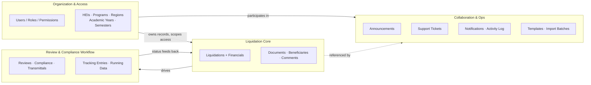
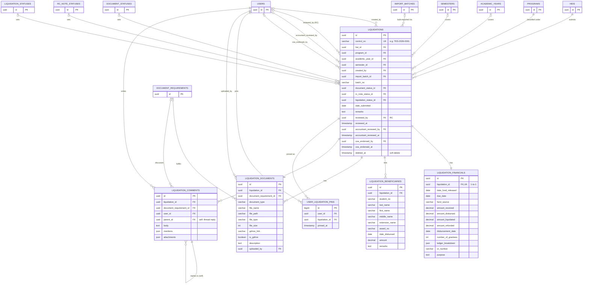
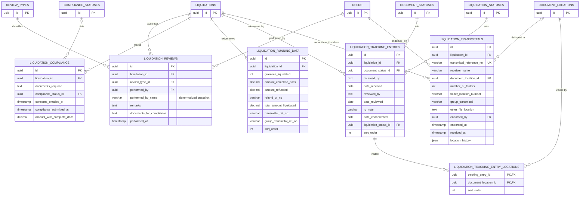
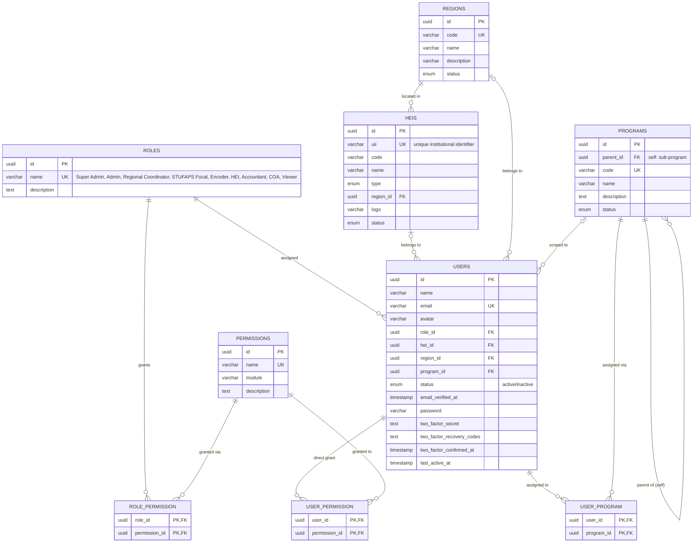
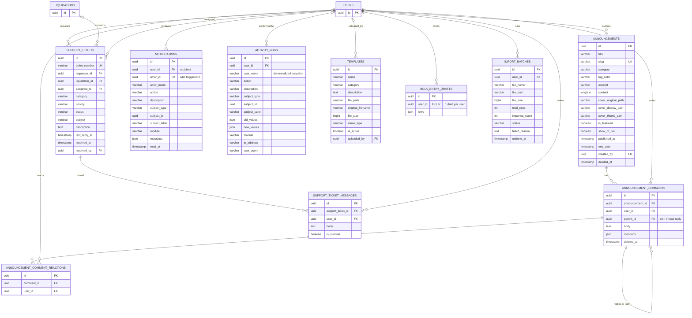
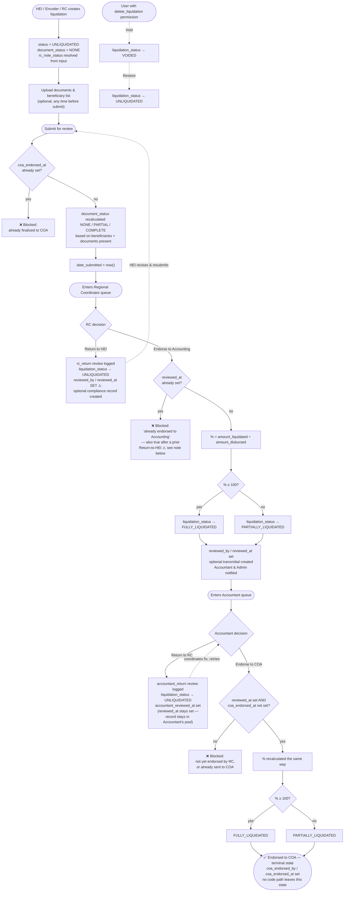

# UniFAST Liquidation System — Database ERD & Workflow

> Generated from a **live introspection** of the `liquid` MySQL database (MySQL 9.7.1, 62 migrations applied), not from reading the model files. Queried via `information_schema.KEY_COLUMN_USAGE` / `information_schema.COLUMNS` on **2026-07-30**. All diagrams render as Mermaid — GitHub, GitLab, Notion, Confluence (with the Mermaid macro), and Obsidian all display them natively.

**Scope note:** this database connection also hosts a second, unrelated schema (`asean_registration`) on the same MySQL server. It is a separate application and is excluded entirely below. Within `liquid`, 8 tables are Laravel framework infrastructure (`cache`, `cache_locks`, `sessions`, `jobs`, `job_batches`, `failed_jobs`, `migrations`, `password_reset_tokens`) — standard, not app-specific, and omitted from the diagrams for signal-to-noise reasons.

## How to read the ERDs

Crow's-foot notation:

| Symbol | Meaning |
|---|---|
| `\|\|--o{` | One (required) → zero-or-many. Standard parent/child, FK is `NOT NULL`. |
| `\|o--o{` | Zero-or-one → zero-or-many. FK is nullable. |
| `\|\|--\|\|` | One-to-one, required. FK is `NOT NULL` **and** `UNIQUE`. |
| `\|o--o\|` | One-to-one, optional. FK is nullable **and** `UNIQUE`. |

All primary/foreign keys in this app are UUID strings stored as `CHAR(36)` — shown below as `uuid` rather than the raw MySQL `char` for clarity. `tinyint(1)` boolean-cast columns are shown as `boolean`. Large diagrams are split by subject area; a table referenced from another area appears there as a **stub** (just its `id`) so the diagram stays self-contained — its full column list lives in its "home" diagram.

---

## 0. System Context



---

## 1A. Liquidation Core & Financials

The center of the app: one row per liquidation report, its 1:1 financial figures, and the records attached directly to it.



> **Sanity check:** as of this snapshot, `liquidations` and `liquidation_financials` both have exactly **5,539** rows — confirming the 1:1 is enforced in practice, not just in schema.

---

## 1B. Review, Compliance & Tracking Workflow

Everything the RC → Accountant → COA review cycle writes to.



---

## 2A. Identity & Access



*Permissions are granted two ways — via `role_permission` (inherited from the assigned role) and `user_permission` (per-user overrides on top of the role). 56 permissions, 9 roles, 176 role→permission grants exist as of this snapshot.*

---

## 2B. Reference & Lookup Data

The controlled vocabularies that drive dropdowns, badges, and status logic app-wide.

```mermaid
erDiagram
    ACADEMIC_YEARS {
        uuid id PK
        varchar code UK
        varchar name
        date start_date
        date end_date
        int sort_order
        boolean is_active
    }

    SEMESTERS {
        uuid id PK
        varchar code UK
        varchar name
        int sort_order
        boolean is_active
    }

    PROGRAM_DUE_DATE_RULES {
        uuid id PK
        uuid program_id FK
        uuid academic_year_id FK
        int due_date_days
    }

    DOCUMENT_REQUIREMENTS {
        uuid id PK
        uuid program_id FK
        varchar code
        varchar name
        text description
        varchar reference_image_path
        text upload_message
        int sort_order
        boolean is_active
        boolean is_required
    }

    ACADEMIC_YEAR_DOCUMENT_REQUIREMENTS {
        uuid id PK
        uuid academic_year_id FK
        uuid document_requirement_id FK
        boolean is_required
        boolean is_active
        int sort_order
    }

    DOCUMENT_LOCATIONS {
        uuid id PK
        varchar name UK
        int sort_order
    }

    LIQUIDATION_STATUSES {
        uuid id PK
        varchar code UK "UNLIQUIDATED / PARTIALLY_LIQUIDATED / FULLY_LIQUIDATED / VOIDED"
        varchar name
        varchar badge_color
        int sort_order
        boolean is_active
    }

    DOCUMENT_STATUSES {
        uuid id PK
        varchar code UK "NONE / PARTIAL / COMPLETE"
        varchar name
        varchar badge_color
        int sort_order
        boolean is_active
    }

    RC_NOTE_STATUSES {
        uuid id PK
        varchar code UK "NO_SUBMISSION / FOR_REVIEW / FOR_COMPLIANCE / FOR_ENDORSEMENT / PARTIALLY_ENDORSED / FULLY_ENDORSED"
        varchar name
        varchar badge_color
        int sort_order
        boolean is_active
    }

    COMPLIANCE_STATUSES {
        uuid id PK
        varchar code UK "pending_hei_review / documents_submitted / under_review / compliant / non_compliant"
        varchar name
        varchar badge_color
        int sort_order
        boolean is_active
    }

    REVIEW_TYPES {
        uuid id PK
        varchar code UK "rc_return / rc_endorsement / hei_resubmission / accountant_return / accountant_endorsement"
        varchar name
        text description
        int sort_order
        boolean is_active
    }

    PROGRAMS { uuid id PK }

    PROGRAMS ||--o{ PROGRAM_DUE_DATE_RULES : "sets SLA for"
    ACADEMIC_YEARS |o--o{ PROGRAM_DUE_DATE_RULES : "per year"
    PROGRAMS ||--o{ DOCUMENT_REQUIREMENTS : "requires"
    ACADEMIC_YEARS ||--o{ ACADEMIC_YEAR_DOCUMENT_REQUIREMENTS : "activates"
    DOCUMENT_REQUIREMENTS ||--o{ ACADEMIC_YEAR_DOCUMENT_REQUIREMENTS : "activated per year"
```



---

## 3. Collaboration, Notifications & Audit



---

## 4. Liquidation Lifecycle — Workflow Flowchart

Traced directly from `LiquidationService` (`submitForReview`, `endorseToAccounting`, `returnToHEI`, `endorseToCOA`, `returnToRC`) and `LiquidationController::void/restore` — this is the actual guard logic in the code, not the idealized process.



### ⚠️ Finding surfaced while building this diagram

`LiquidationService::returnToHEI()` sets `reviewed_by` / `reviewed_at` — the same two columns `endorseToAccounting()` uses to mean *"RC already endorsed this."* Its guard is a blind non-null check:

```php
// endorseToAccounting()
if ($liquidation->reviewed_at) {
    throw new \InvalidArgumentException('This liquidation has already been endorsed to Accounting.');
}
```

Walk the sequence: HEI submits → RC **returns to HEI** (sets `reviewed_at`) → HEI fixes and resubmits → RC tries to **endorse to Accounting** → the guard sees `reviewed_at` is non-null and rejects it with "already endorsed," even though it never was. I traced this through `LiquidationService.php:713-915` and the three `add*Return`/`addHEIResubmission` helpers in `Liquidation.php` (none of them clear `reviewed_at`), so this isn't a guess — every liquidation that has ever been returned-to-HEI once looks permanently "already endorsed" to that guard. Worth a look when you have time; happy to patch it (the natural fix is scoping the guard to `reviewed_at && !returned-to-HEI-since`, or clearing `reviewed_by`/`reviewed_at` in `returnToHEI()` and using a dedicated flag instead of overloading those two columns for both meanings).

### Role → workflow stage

| Role | Verified action in this workflow |
|---|---|
| **HEI** | Creates and submits liquidations for their own institution (`hei_id`-scoped). |
| **Regional Coordinator** | Creates liquidations for HEIs in their region; endorses to Accounting or returns to HEI. Region-scoped throughout. |
| **STUFAPS Focal** | Same endorse/return actions as RC, scoped by program instead of region (`getParentScopedProgramIds()`). |
| **Accountant** | Endorses to COA or returns to RC. |
| **Encoder** | Data-entry role; shares RC's program-scoping pattern for record creation. |
| **Super Admin / Admin** | Unscoped — can filter by region, manage roles/users/HEIs/programs/reference data. |
| **COA** | Named terminal destination of the workflow (`coa_endorsed_*`); specific route/permission bindings weren't traced in this pass. |
| **Viewer** | Exists in `roles`; not exercised in the code paths read for this document. |

---

## Appendix

### A. Full foreign-key list (live introspection, 2026-07-30)

```
academic_year_document_requirements.academic_year_id -> academic_years.id
academic_year_document_requirements.document_requirement_id -> document_requirements.id
activity_logs.user_id -> users.id
announcement_comment_reactions.comment_id -> announcement_comments.id
announcement_comment_reactions.user_id -> users.id
announcement_comments.announcement_id -> announcements.id
announcement_comments.parent_id -> announcement_comments.id
announcement_comments.user_id -> users.id
announcements.created_by -> users.id
bulk_entry_drafts.user_id -> users.id
document_requirements.program_id -> programs.id
heis.region_id -> regions.id
import_batches.user_id -> users.id
liquidation_beneficiaries.liquidation_id -> liquidations.id
liquidation_comments.document_requirement_id -> document_requirements.id
liquidation_comments.liquidation_id -> liquidations.id
liquidation_comments.parent_id -> liquidation_comments.id
liquidation_comments.user_id -> users.id
liquidation_compliance.compliance_status_id -> compliance_statuses.id
liquidation_compliance.liquidation_id -> liquidations.id
liquidation_documents.document_requirement_id -> document_requirements.id
liquidation_documents.liquidation_id -> liquidations.id
liquidation_documents.uploaded_by -> users.id
liquidation_financials.liquidation_id -> liquidations.id
liquidation_reviews.liquidation_id -> liquidations.id
liquidation_reviews.performed_by -> users.id
liquidation_reviews.review_type_id -> review_types.id
liquidation_running_data.liquidation_id -> liquidations.id
liquidation_tracking_entries.document_status_id -> document_statuses.id
liquidation_tracking_entries.liquidation_id -> liquidations.id
liquidation_tracking_entries.liquidation_status_id -> liquidation_statuses.id
liquidation_tracking_entry_locations.document_location_id -> document_locations.id
liquidation_tracking_entry_locations.tracking_entry_id -> liquidation_tracking_entries.id
liquidation_transmittals.document_location_id -> document_locations.id
liquidation_transmittals.endorsed_by -> users.id
liquidation_transmittals.liquidation_id -> liquidations.id
liquidations.academic_year_id -> academic_years.id
liquidations.accountant_reviewed_by -> users.id
liquidations.coa_endorsed_by -> users.id
liquidations.created_by -> users.id
liquidations.document_status_id -> document_statuses.id
liquidations.hei_id -> heis.id
liquidations.import_batch_id -> import_batches.id
liquidations.liquidation_status_id -> liquidation_statuses.id
liquidations.program_id -> programs.id
liquidations.rc_note_status_id -> rc_note_statuses.id
liquidations.reviewed_by -> users.id
liquidations.semester_id -> semesters.id
notifications.actor_id -> users.id
notifications.user_id -> users.id
program_due_date_rules.academic_year_id -> academic_years.id
program_due_date_rules.program_id -> programs.id
programs.parent_id -> programs.id
role_permission.permission_id -> permissions.id
role_permission.role_id -> roles.id
sessions.user_id -> users.id
support_ticket_messages.support_ticket_id -> support_tickets.id
support_ticket_messages.user_id -> users.id
support_tickets.assigned_to -> users.id
support_tickets.liquidation_id -> liquidations.id
support_tickets.requester_id -> users.id
support_tickets.resolved_by -> users.id
templates.uploaded_by -> users.id
user_liquidation_pins.liquidation_id -> liquidations.id
user_liquidation_pins.user_id -> users.id
user_permission.permission_id -> permissions.id
user_permission.user_id -> users.id
user_program.program_id -> programs.id
user_program.user_id -> users.id
users.hei_id -> heis.id
users.program_id -> programs.id
users.region_id -> regions.id
users.role_id -> roles.id
```

### B. Row counts snapshot (2026-07-30)

Included for scale context — note most workflow-satellite tables (documents, beneficiaries, comments, reviews, compliance, tracking, transmittals) are currently empty relative to 5,539 liquidations, since that volume came from bulk import batches rather than the full per-record UI workflow.

| Table | Rows | Table | Rows |
|---|---|---|---|
| liquidations | 5,539 | permissions | 56 |
| liquidation_financials | 5,539 | role_permission | 176 |
| heis | 177 | roles | 9 |
| users | 203 | semesters | 6 |
| document_locations | 82 | rc_note_statuses | 6 |
| document_requirements | 42 | compliance_statuses | 5 |
| academic_years | 10 | review_types | 5 |
| program_due_date_rules | 10 | liquidation_statuses | 4 |
| programs | 9 | document_statuses | 3 |
| regions | 2 | user_program | 7 |
| import_batches | 2 | activity_logs | 9 |
| notifications | 1 | sessions | 3 |
| academic_year_document_requirements | 3 | cache | 11 |

All other listed tables (beneficiaries, documents, comments, compliance, reviews, running_data, tracking entries/locations, transmittals, announcements + children, support tickets + messages, templates, bulk_entry_drafts, user_liquidation_pins, user_permission) are at 0 rows as of this snapshot.
